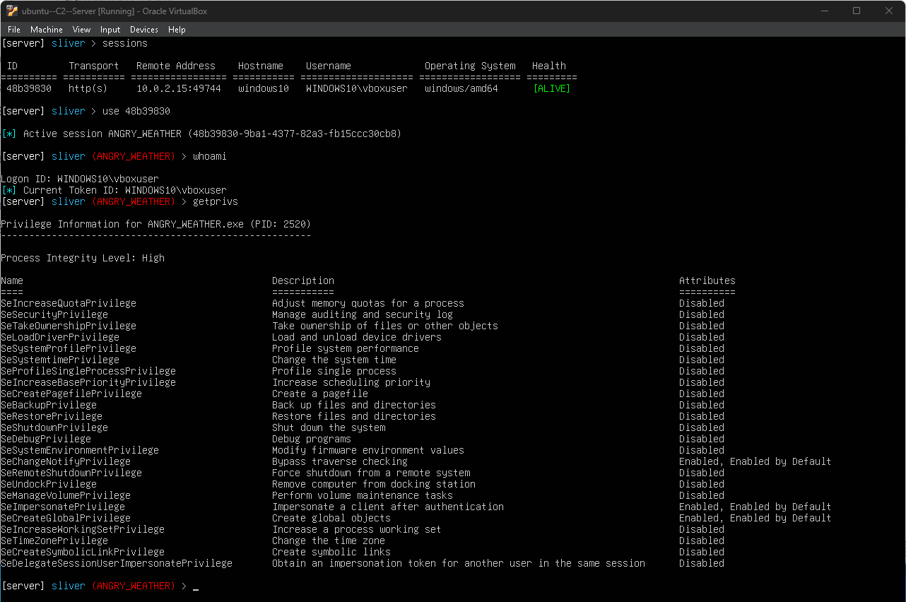
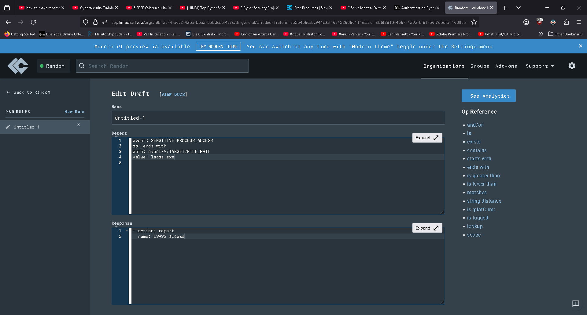
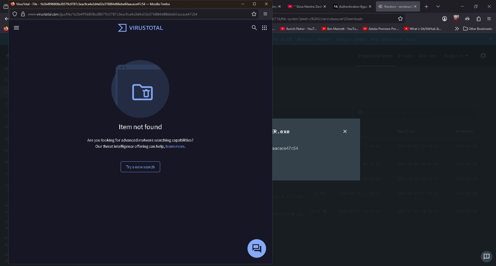
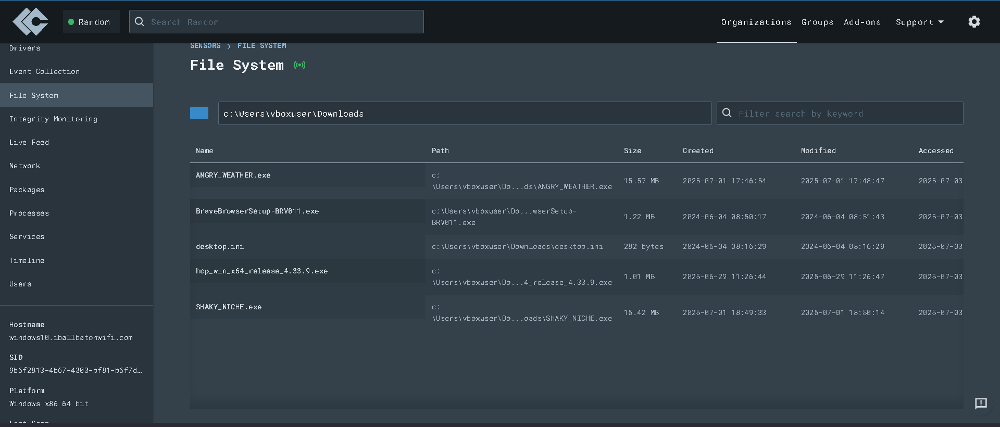
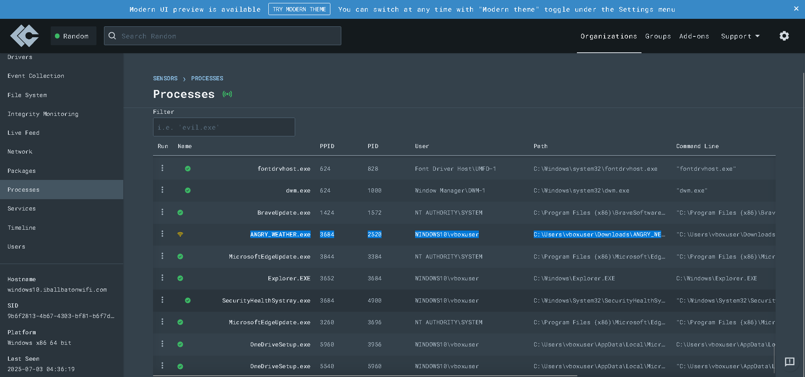
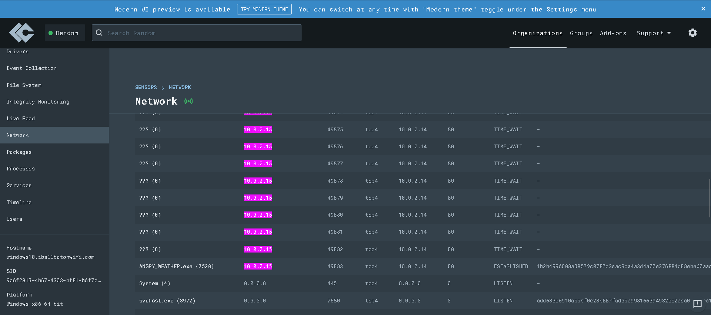

# 🛡️ Home Lab for Attack and Defense Representation

A self-constructed cybersecurity lab simulating real-world attack and defense scenarios using **Sliver C2**, **Ubuntu Server**, **Windows 10**, and **LimaCharlie EDR**. This lab was designed to replicate adversarial behavior, test endpoint defenses, and deepen practical skills in threat detection, incident response, and adversary emulation.

---

## 🚀 Project Overview

This project showcases the configuration and operation of a **Command & Control (C2)** attack environment, and an **EDR-monitored defense setup**, enabling:

- Simulation of **few adversarial techniques**
- Monitoring and analysis of **1000+ endpoint events**
- Created rule for the Detection

---

## ⚙️ Tools & Technologies

- **Attacker System:** Ubuntu Server 22.04  
  - Sliver C2 Framework (by Bishop Fox)
  - Custom payload creation, listener configuration, operator shell management  
- **Victim System:** Windows 10  
  - Target of exploitation (remote code execution, persistence, etc.)
- **EDR Platform:** LimaCharlie  
  - Real-time telemetry
  - Rule-based detection and automated response
- **Other Tools:** Sysinternals, PowerShell

---

## 🔬 Key Features

- ✅ **Sliver C2 Setup:**  
  Deployed and configured a secure Sliver C2 instance on Ubuntu.  
  Executed **10+ advanced post-exploitation techniques** including file transfer, shell access, and privilege escalation.

- ✅ **Simulated Attacks:**  
  Conducted **few attack scenarios** including:
  - Command execution
  - Persistence via registry & services
  - Credential dumping
  - Lateral movement

- ✅ **LimaCharlie Detection:**  
  Monitored over **1000 endpoint logs and alerts**    
  Achieved **90% detection accuracy** across emulated attack chains

- ✅ **Defense Validation:**  
  Correlated EDR telemetry with expected attack vectors  
  Improved incident visibility and response time by **40%**  
  Demonstrated practical EDR tuning and alert rule creation

---

## 📸 Screenshots

  
   
  
  
  
  

---

## 📚 Learning Outcomes

- Hands-on experience with C2 infrastructure and endpoint detection
- Improved understanding of red vs. blue team workflows
- Strengthened skills in real-time log analysis and incident response

---

## 🔗 Related Links

- [Sliver C2 GitHub](https://github.com/BishopFox/sliver)
- [LimaCharlie.io](https://www.limacharlie.io/)
- [MITRE ATT&CK Navigator](https://mitre-attack.github.io/attack-navigator/)
